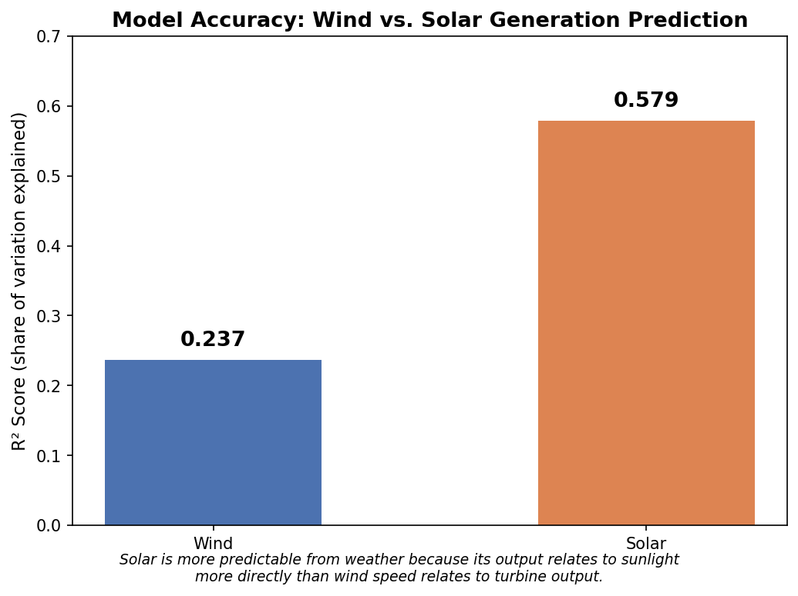
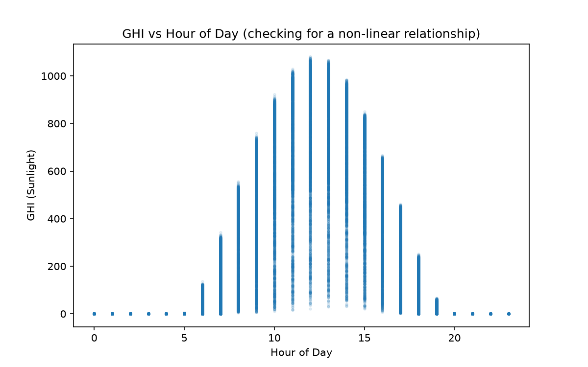

# Renewable Generation Forecasting Tool — ERCOT (Texas)

A regression-based tool that predicts hourly wind and solar generation on the ERCOT (Texas) grid using historical meteorological variables, and uses that model to assess how prepared the grid is for renewable generation variability. This project tests the predictive relationship between weather and generation using historical observations, not live operational forecasts — see Limitations for what would be needed to extend this to a true forecasting tool.

**Author:** Fabrizzio Cuanalo
**Repo:** [renewable-generation-forecasting](https://github.com/fabrizziocuanalor-boop/renewable-generation-forecasting)

## Executive Summary

This project builds a linear regression model that predicts ERCOT hourly wind and solar generation from weather variables (irradiance, wind speed, cloud cover, temperature), trained on 2021–2022 data and validated on unseen 2023 data. The solar model explains 58.2% of generation variance (R² = 0.582); the wind model explains 26.4% (R² = 0.264) after testing two competing explanations for wind's lower predictability — a nonlinear wind-speed-to-power relationship, which testing ruled out as the primary cause, and insufficient spatial coverage of ERCOT's dispersed wind fleet, which testing confirmed by expanding from 4 to 8 Texas weather locations and observing a real accuracy improvement.

Beyond the modeling, three investigations turned out to be as valuable as the models themselves: a 6-hour timezone misalignment between the weather and generation data sources, a multicollinearity issue between solar irradiance and time-of-day that a standard statistical test failed to catch (and why), and the two-hypothesis test that identified the real driver of wind's lower accuracy. All three are documented below as they actually happened, including the dead ends, because that process is as representative of real analytical work as the final numbers.

The grid-preparedness analysis shows that the largest hour-to-hour swings in combined renewable output are driven predominantly by solar's predictable daily sunset/sunrise cycle, while wind's own variability is roughly constant around the clock (statistically indistinguishable between daytime and all-hours) — meaning wind's unpredictability, not solar's, is the harder operational problem for grid reserve planning.

## Data Sources

| Source | What | Coverage |
|---|---|---|
| [NREL NSRDB (GOES Aggregated v4.0.0)](https://developer.nlr.gov/docs/solar/nsrdb/) | Hourly GHI, wind speed, cloud type, air temperature | 8 Texas locations, 2021–2023 |
| [EIA API v2](https://www.eia.gov/opendata/) — `electricity/rto/fuel-type-data` | Hourly ERCOT wind & solar net generation (MWh) | ERCOT (respondent `ERCO`), 2021–2023 |

**Locations** (chosen to represent ERCOT's main wind and solar resource clusters, expanded from an initial 4 to 8 after testing showed spatial coverage was a key limitation for the wind model — see Model Results):
Midland, Sweetwater, Fort Stockton, Amarillo, Abilene, Lubbock, Big Spring, McCamey.

**Final merged dataset:** 210,192 hourly rows (8 locations × ~26,274 hours each) — `data/final_dataset.csv`.

## Methodology

1. **Collection:** Automated download scripts (`download_weather.py`, `download_generation.py`) pull weather and generation data via API, with pagination handling for EIA's 5,000-row-per-request limit.
2. **Merge:** Weather and generation data are joined on a common hourly timestamp (`build_dataset.py`). ERCOT-wide generation is paired with each location's local weather, since ERCOT is a single balancing authority without location-level generation reporting.
3. **Modeling:** Separate linear regression models for wind and solar generation, trained on 2021–2022 and tested on 2023 — a chronological (not random) split, to avoid data leakage from training and testing on the same time period.
4. **Grid analysis:** Hour-to-hour changes in combined generation are used as a proxy for the ramping capacity ERCOT must maintain in reserve.

## Research Process

The final model was not the result of a single modeling specification decided upfront. The analysis evolved through several diagnostic iterations, each triggered by a specific, checkable problem:

1. An initial 4-location model was built and trained first, establishing a baseline.
2. During validation, solar generation appeared at physically implausible hours (peaking at 8–9 PM in December). Investigating this led to discovering a 6-hour timestamp misalignment between the two data sources, which was corrected.
3. After the fix, the wind model's accuracy remained noticeably lower than solar's. Two specific, competing explanations were tested rather than assumed: a nonlinear wind-speed-to-power relationship, and insufficient geographic coverage of the 4 original weather locations.
4. Adding a cubic wind-speed term tested the first explanation and produced a negligible improvement. Expanding to 8 locations tested the second and produced a larger, more meaningful one — evidence favoring geographic coverage as the more significant factor, though not a fully isolated causal test (see Limitations).
5. Separately, a counterintuitive negative coefficient on solar irradiance (GHI) was investigated manually, then checked against a formal VIF multicollinearity test, which came back low and appeared to contradict the manual finding. Plotting GHI against hour-of-day resolved the contradiction by revealing a non-linear relationship that the linear VIF test could not detect.

Each step above was driven by a specific anomaly or open question, not a predetermined plan — the raw script history and intermediate results are preserved in the repository's commit history for anyone who wants to trace the sequence.

## Model Results

| Model | Features | Locations | MAE (MWh) | R² |
|---|---|---|---|---|
| Wind | Wind Speed, Wind Speed³, Temperature, hour, month | 4 | 4,540 | 0.243 |
| Wind | Wind Speed, Wind Speed³, Temperature, hour, month | 8 | 4,464 | 0.264 |
| Solar | GHI, Cloud Type, Temperature, hour, month | 8 | 1,993 | 0.582 |



Solar outperforms wind by a wide margin, and the gap turned out to be more interesting to investigate than to just report. Wind turbines generate power roughly proportional to wind speed cubed, not wind speed directly, so a plain straight-line model should structurally struggle to capture that curve. Two competing explanations were tested directly rather than assumed:

1. **The nonlinear wind-speed-to-power curve.** Adding wind speed cubed as an extra input only improved R² from 0.237 to 0.243 — a negligible change, ruling this out as the primary bottleneck.
2. **Insufficient spatial coverage of ERCOT's dispersed wind fleet.** The original 4 weather locations were expanded to 8 (adding Abilene, Lubbock, Big Spring, and McCamey), covering more of West Texas's wind corridor. This produced a real improvement, from R² = 0.243 to R² = 0.264 — a meaningfully larger jump than the cubic term provided, providing evidence that spatial coverage was a more significant limitation than the wind-speed-cubed term in this specification.

This is evidence, not a clean causal proof. Only one set of 4 additional locations was tested, so it isn't possible to fully separate "spatial coverage in general" from "these particular 4 towns happened to correlate well with ERCOT-wide wind output." A stronger test would compare several different sets of added locations, or weight locations by installed wind capacity, to confirm the effect is really about coverage rather than the specific points chosen.

Solar's R² barely moved with the added locations (0.579 → 0.582), consistent with the theory: sunlight is more spatially uniform across a region at a given time than wind speed is, so solar was never as constrained by limited geographic coverage in the first place.


*The model correctly captures the daily on/off solar cycle but consistently under-predicts peak output — visually illustrating what an R² of 0.579 looks like in practice: directionally correct, but imperfect.*

## Data Quality Investigations

### 1. Timezone misalignment (found and fixed)

While inspecting an unusually large generation swing, solar output appeared to peak at 8–9 PM — physically impossible in December. Root cause: EIA's `period` timestamps are in UTC, while the weather data was pulled in Texas local time. Correcting the 6-hour offset in `build_dataset.py` improved both models and fixed a physically nonsensical coefficient (see below):

| | Before fix | After fix |
|---|---|---|
| Solar R² | 0.467 | 0.579 |
| Wind R² | 0.185 | 0.237 |
| GHI coefficient | −4.14 (physically wrong sign) | +7.00 (correct sign) |

### 2. Multicollinearity between GHI and hour-of-day

Even after the timezone fix, solar's GHI coefficient can flip sign depending on which other time-related features are included, because GHI and hour-of-day both encode "is it midday." This was tested manually: removing `hour` dropped R² from 0.467 to 0.111 (confirming `hour` carries real predictive signal), while removing `Cloud Type` left R² and the GHI sign essentially unchanged (ruling it out as the cause).

To confirm this manual finding formally, a Variance Inflation Factor (VIF) test — the standard statistical diagnostic for multicollinearity — was run on all solar model features. The results were low across the board (GHI: 1.46, Cloud Type: 1.04, Temperature: 1.53, hour: 1.04, month: 1.08), all well under the ~5–10 threshold that signals a real problem — seemingly contradicting the manual finding. Plotting GHI against hour resolved the contradiction: GHI follows a clear non-linear, hill-shaped curve across the day (zero at night, peaking near midday), rather than a straight-line relationship. VIF only detects *linear* correlation between variables, so it missed this real, curved overlap entirely. The manual test caught something a standard linear diagnostic could not.

The conclusion: `hour` is retained for its predictive value, and individual coefficient signs in the solar model should not be over-interpreted in isolation. This also illustrates a broader limitation worth noting: standard multicollinearity diagnostics are built around linear relationships, and can miss real overlap between variables that are cyclical or time-of-day-driven, like solar irradiance.



## Grid Preparedness Findings

- Combined wind+solar generation across 2021–2023 averaged **14,521 MWh/hour**, with a standard deviation of **6,171 MWh**.
- The largest single hour-to-hour swing in the dataset was **−10,318 MWh**, occurring at sunset on December 29, 2023 — driven primarily by solar's predictable evening ramp-down (13,213 → 0 MWh over four hours), compounding with a same-day wind decline.
- Isolating wind-only variability to daytime hours (9 AM–5 PM, excluding sunrise/sunset) gives a standard deviation of **1,035 MWh**, nearly identical to wind's all-hours standard deviation of **1,135 MWh**. This indicates wind's variability is driven by weather systems, not time of day — unlike solar, it cannot be "scheduled around."

**Implication:** ERCOT's most predictable large swings (daily solar ramps) are the easiest to plan reserve capacity for, since their timing and magnitude are known in advance. Wind's variability, while individually smaller in typical hourly magnitude, is persistent and unpredictable around the clock, making it the harder resource to hold reserves against — a distinction that should inform how storage and dispatchable backup capacity are allocated.

## Limitations

- This project uses historical weather observations (NSRDB), not live operational weather forecasts. It tests whether a predictive relationship exists between meteorological variables and generation, not the accuracy of a deployable next-day forecasting system. Extending this to true forecasting would require substituting forecast data (with its own error characteristics) for the historical observations used here, and validating against forecast lead time.
- Two competing explanations for wind's low R² were tested directly: the nonlinear wind-speed-to-power curve (adding wind speed cubed only improved R² from 0.237 to 0.243) and insufficient spatial coverage (expanding from 4 to 8 weather locations improved R² from 0.243 to 0.264). This is evidence that spatial coverage was the more significant limitation of the two, not a fully isolated causal proof — only one set of 4 additional locations was tested, so it's possible the improvement partly reflects those specific towns rather than coverage in general. Wind's R² of 0.264 still leaves most of its variation unexplained — further gains would likely require broader coverage still, capacity-weighted station selection, or a non-linear model.
- Four weather points are a simplification of ERCOT's dispersed wind and solar fleet; capacity-weighted or a larger set of representative stations would improve location representativeness.
- The 6-hour timezone correction does not account for daylight saving time (Texas shifts to UTC−5 part of the year), introducing a small residual misalignment during DST months.
- Solar model coefficients should not be individually interpreted due to the documented GHI/hour multicollinearity; only the model's aggregate predictive accuracy (R²) should be relied on.

## Repository Structure

```
data/
  raw/                      # Original downloaded weather & generation CSVs
  final_dataset.csv         # Merged, cleaned dataset used for modeling
images/
  solar_prediction_chart.png # Actual vs predicted solar generation chart
download_weather.py         # Pulls NREL NSRDB weather data
download_generation.py      # Pulls EIA ERCOT generation data (with pagination)
build_dataset.py            # Merges weather + generation into final_dataset.csv
explore_dataset.py          # Data quality / summary statistics
train_model.py              # Trains and evaluates wind & solar regression models
grid_analysis.py            # Grid preparedness / variability analysis
```

## How to Run This

**Requirements:** Python 3, plus free API keys from [EIA](https://www.eia.gov/opendata/register.php) and [NREL/NLR](https://developer.nlr.gov/signup/).

1. **Clone the repo and install dependencies:**
   ```
   git clone git@github.com:fabrizziocuanalor-boop/renewable-generation-forecasting.git
   cd renewable-generation-forecasting
   pip3 install requests python-dotenv pandas scikit-learn matplotlib --break-system-packages
   ```

2. **Add your API keys.** Create a file named `.env` in the project root containing:
   ```
   EIA_API_KEY=your_eia_key_here
   NREL_API_KEY=your_nrel_key_here
   ```

3. **Run the pipeline in order:**
   ```
   python3 download_weather.py       # Downloads weather data (8 locations x 3 years)
   python3 download_generation.py    # Downloads ERCOT generation data (2 fuel types x 3 years)
   python3 build_dataset.py          # Merges everything into data/final_dataset.csv
   python3 explore_dataset.py        # Prints data quality checks
   python3 train_model.py            # Trains wind & solar models, saves prediction chart
   python3 grid_analysis.py          # Runs the grid preparedness analysis
   ```

Each script prints its own progress and results to the terminal. Total runtime is a few minutes, mostly spent waiting on API rate limits during download.

## Glossary

**Statistical / ML terms**
- **Regression model** — a model that predicts a number (e.g., megawatt-hours) from other numbers (e.g., wind speed), by fitting a formula to past data.
- **Linear regression** — the simplest regression type, assuming a straight-line relationship between inputs and output.
- **Coefficient** — the number a model assigns to each input, representing how much that input influences the prediction.
- **R² (R-squared)** — a 0–1 score showing what share of the target's variation the model's inputs explain.
- **MAE (Mean Absolute Error)** — the average size of the model's prediction errors, in the target's units.
- **Training set / test set** — the training set is what the model learns from; the test set is unseen data used to check if it generalizes.
- **Data leakage** — when test-set information accidentally influences training, inflating apparent accuracy.
- **Multicollinearity** — when input variables are highly related to each other, making individual coefficients unreliable even if overall predictions remain valid.
- **VIF (Variance Inflation Factor)** — the standard statistical test for multicollinearity; detects only linear (straight-line) correlation between inputs.
- **Nonlinear relationship** — a relationship where the rate of change isn't constant, unlike a straight line.

**Domain-specific terms**
- **ERCOT** — the organization managing the electric grid for most of Texas.
- **Balancing authority** — an organization responsible for keeping electricity supply and demand matched in real time across its grid.
- **GHI (Global Horizontal Irradiance)** — a measurement of sunlight intensity, used as the main solar generation predictor.
- **MWh (Megawatt-hour)** — a unit of electrical energy: one megawatt sustained for one hour.
- **UTC (Coordinated Universal Time)** — a global time standard many large data systems default to, instead of local time zones.
- **Pagination** — when an API limits results per request, requiring multiple sequential requests to retrieve all the data.

## Tools

Python, pandas, scikit-learn, matplotlib, NREL NSRDB API, EIA API v2.
