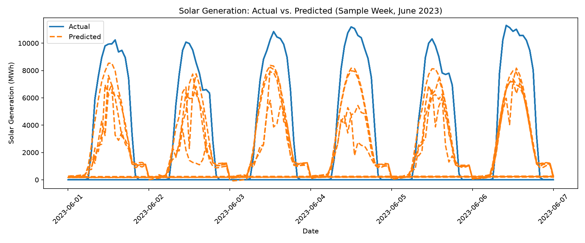

# Renewable Generation Forecasting Tool — ERCOT (Texas)

A regression-based tool that predicts hourly wind and solar generation on the ERCOT (Texas) grid from weather forecast variables, and uses that model to assess how prepared the grid is for renewable generation variability.

**Author:** Fabrizzio Cuanalo
**Repo:** [renewable-generation-forecasting](https://github.com/fabrizziocuanalor-boop/renewable-generation-forecasting)

## Executive Summary

This project builds a linear regression model that predicts ERCOT hourly wind and solar generation from weather variables (irradiance, wind speed, cloud cover, temperature), trained on 2021–2022 data and validated on unseen 2023 data. The solar model explains 57.9% of generation variance (R² = 0.579); the wind model explains 23.7% (R² = 0.237) — a gap consistent with the physical reality that wind power follows a nonlinear (roughly cubic) relationship with wind speed that a linear model cannot fully capture, while solar output tracks irradiance more directly.

Beyond the model itself, two data-quality investigations turned out to be as valuable as the modeling: a 6-hour timezone misalignment between the weather and generation data sources, and a multicollinearity issue between solar irradiance and time-of-day in the regression coefficients. Both are documented below, including how they were found and resolved, because catching and correcting them is as representative of real analytical work as the model itself.

The grid-preparedness analysis shows that the largest hour-to-hour swings in combined renewable output are driven predominantly by solar's predictable daily sunset/sunrise cycle, while wind's own variability is roughly constant around the clock (statistically indistinguishable between daytime and all-hours) — meaning wind's unpredictability, not solar's, is the harder operational problem for grid reserve planning.

## Data Sources

| Source | What | Coverage |
|---|---|---|
| [NREL NSRDB (GOES Aggregated v4.0.0)](https://developer.nlr.gov/docs/solar/nsrdb/) | Hourly GHI, wind speed, cloud type, air temperature | 4 Texas locations, 2021–2023 |
| [EIA API v2](https://www.eia.gov/opendata/) — `electricity/rto/fuel-type-data` | Hourly ERCOT wind & solar net generation (MWh) | ERCOT (respondent `ERCO`), 2021–2023 |

**Locations** (chosen to represent ERCOT's main wind and solar resource clusters):
Midland, Sweetwater, Fort Stockton, Amarillo.

**Final merged dataset:** 105,096 hourly rows (4 locations × ~26,274 hours each) — `data/final_dataset.csv`.

## Methodology

1. **Collection:** Automated download scripts (`download_weather.py`, `download_generation.py`) pull weather and generation data via API, with pagination handling for EIA's 5,000-row-per-request limit.
2. **Merge:** Weather and generation data are joined on a common hourly timestamp (`build_dataset.py`). ERCOT-wide generation is paired with each location's local weather, since ERCOT is a single balancing authority without location-level generation reporting.
3. **Modeling:** Separate linear regression models for wind and solar generation, trained on 2021–2022 and tested on 2023 — a chronological (not random) split, to avoid data leakage from training and testing on the same time period.
4. **Grid analysis:** Hour-to-hour changes in combined generation are used as a proxy for the ramping capacity ERCOT must maintain in reserve.

## Model Results

| Model | Features | MAE (MWh) | R² |
|---|---|---|---|
| Wind | Wind Speed, Temperature, hour, month | 4,566 | 0.237 |
| Solar | GHI, Cloud Type, Temperature, hour, month | 1,998 | 0.579 |

Solar outperforms wind because irradiance-to-output is a more direct, closer-to-linear relationship than wind speed-to-output, which follows a cubic power curve up to rated capacity and then flattens or cuts out — a nonlinearity a simple linear model cannot represent. ERCOT's wind fleet is also geographically dispersed across hundreds of miles, so four representative weather points inherently capture less of the system-wide picture than they do for solar.



*The model correctly captures the daily on/off solar cycle but consistently under-predicts peak output — visually illustrating what an R² of 0.579 looks like in practice: directionally correct, but imperfect.*

## Data Quality Investigations

### 1. Timezone misalignment (found and fixed)

While inspecting an unusually large generation swing, solar output appeared to peak at 8–9 PM — physically impossible in December. Root cause: EIA's `period` timestamps are in UTC, while the weather data was pulled in Texas local time. Correcting the 6-hour offset in `build_dataset.py` improved both models and fixed a physically nonsensical coefficient (see below):

| | Before fix | After fix |
|---|---|---|
| Solar R² | 0.467 | 0.579 |
| Wind R² | 0.185 | 0.237 |
| GHI coefficient | −4.14 (physically wrong sign) | +7.00 (correct sign) |

### 2. Multicollinearity between GHI and hour-of-day

Even after the timezone fix, solar's GHI coefficient can flip sign depending on which other time-related features are included, because GHI and hour-of-day both encode "is it midday." This was tested directly: removing `hour` dropped R² from 0.467 to 0.111 (confirming `hour` carries real predictive signal), while removing `Cloud Type` left R² and the GHI sign essentially unchanged (ruling it out as the cause). The conclusion: `hour` is retained for its predictive value, and individual coefficient signs in the solar model should not be over-interpreted in isolation — the model's overall R² remains a valid measure of predictive power regardless.

## Grid Preparedness Findings

- Combined wind+solar generation across 2021–2023 averaged **14,521 MWh/hour**, with a standard deviation of **6,171 MWh**.
- The largest single hour-to-hour swing in the dataset was **−10,318 MWh**, occurring at sunset on December 29, 2023 — driven primarily by solar's predictable evening ramp-down (13,213 → 0 MWh over four hours), compounding with a same-day wind decline.
- Isolating wind-only variability to daytime hours (9 AM–5 PM, excluding sunrise/sunset) gives a standard deviation of **1,035 MWh**, nearly identical to wind's all-hours standard deviation of **1,135 MWh**. This indicates wind's variability is driven by weather systems, not time of day — unlike solar, it cannot be "scheduled around."

**Implication:** ERCOT's most predictable large swings (daily solar ramps) are the easiest to plan reserve capacity for, since their timing and magnitude are known in advance. Wind's variability, while individually smaller in typical hourly magnitude, is persistent and unpredictable around the clock, making it the harder resource to hold reserves against — a distinction that should inform how storage and dispatchable backup capacity are allocated.

## Limitations

- Linear regression cannot capture wind power's nonlinear (cubic) relationship with wind speed; a polynomial or tree-based model would likely improve wind R² further.
- Four weather points are a simplification of ERCOT's dispersed wind and solar fleet; capacity-weighted or a larger set of representative stations would improve location representativeness.
- The 6-hour timezone correction does not account for daylight saving time (Texas shifts to UTC−5 part of the year), introducing a small residual misalignment during DST months.
- Solar model coefficients should not be individually interpreted due to the documented GHI/hour multicollinearity; only the model's aggregate predictive accuracy (R²) should be relied on.

## Repository Structure

```
data/
  raw/                      # Original downloaded weather & generation CSVs
  final_dataset.csv         # Merged, cleaned dataset used for modeling
images/
  solar_prediction_chart.png # Actual vs predicted solar generation chart
download_weather.py         # Pulls NREL NSRDB weather data
download_generation.py      # Pulls EIA ERCOT generation data (with pagination)
build_dataset.py            # Merges weather + generation into final_dataset.csv
explore_dataset.py          # Data quality / summary statistics
train_model.py              # Trains and evaluates wind & solar regression models
grid_analysis.py            # Grid preparedness / variability analysis
```

## How to Run This

**Requirements:** Python 3, plus free API keys from [EIA](https://www.eia.gov/opendata/register.php) and [NREL/NLR](https://developer.nlr.gov/signup/).

1. **Clone the repo and install dependencies:**
   ```
   git clone git@github.com:fabrizziocuanalor-boop/renewable-generation-forecasting.git
   cd renewable-generation-forecasting
   pip3 install requests python-dotenv pandas scikit-learn matplotlib --break-system-packages
   ```

2. **Add your API keys.** Create a file named `.env` in the project root containing:
   ```
   EIA_API_KEY=your_eia_key_here
   NREL_API_KEY=your_nrel_key_here
   ```

3. **Run the pipeline in order:**
   ```
   python3 download_weather.py       # Downloads weather data (4 locations x 3 years)
   python3 download_generation.py    # Downloads ERCOT generation data (2 fuel types x 3 years)
   python3 build_dataset.py          # Merges everything into data/final_dataset.csv
   python3 explore_dataset.py        # Prints data quality checks
   python3 train_model.py            # Trains wind & solar models, saves prediction chart
   python3 grid_analysis.py          # Runs the grid preparedness analysis
   ```

Each script prints its own progress and results to the terminal. Total runtime is a few minutes, mostly spent waiting on API rate limits during download.

## Tools

Python, pandas, scikit-learn, matplotlib, NREL NSRDB API, EIA API v2.
